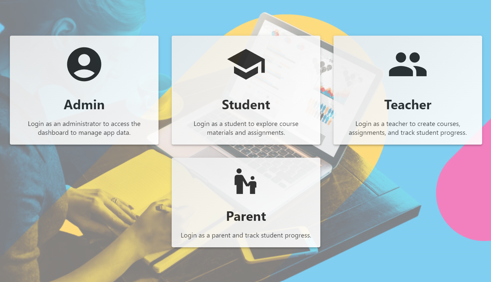
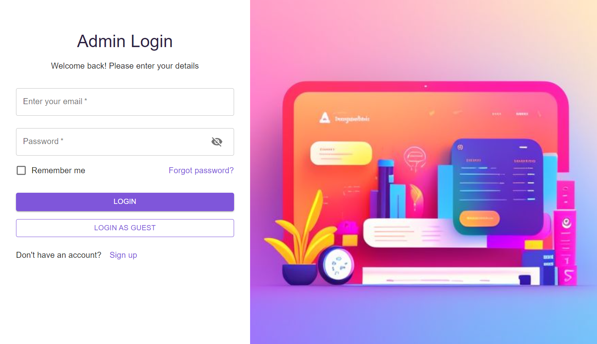
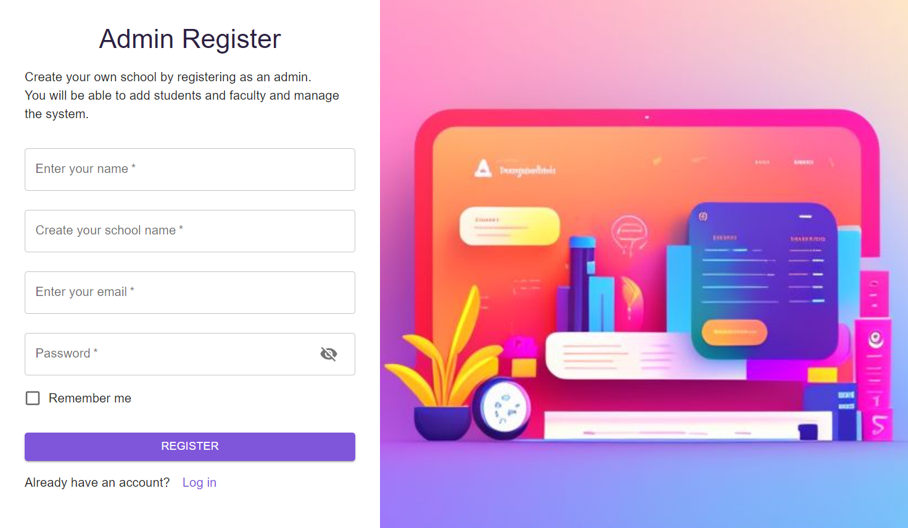
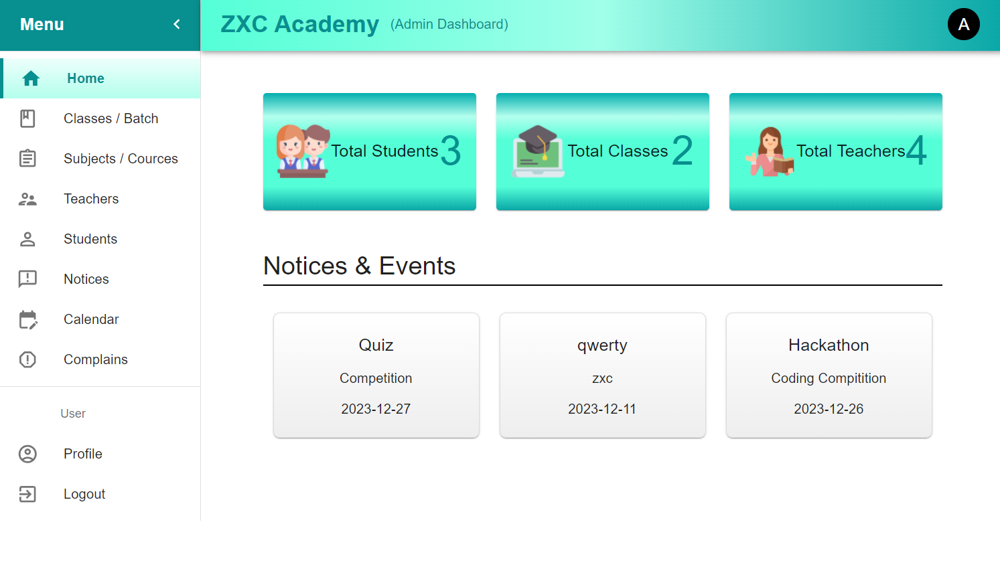

# Lerning/School Management System

## Overview

This School Management System is a web-based application developed using the MERN stack (MongoDB, Express.js, React, Node.js). It provides a comprehensive solution for managing various aspects of a school, including student information, class schedules, attendance, and more.

## Features

- **User Authentication**: Secure authentication system for administrators, teachers, parents and students.
- **Student Management**: Track student information, academic records, and attendance.
- **Class Scheduling**: Efficiently manage class schedules and teacher assignments.
- **Attendance Tracking**: Record and monitor student attendance easily.
- **Gradebook**: Keep track of student grades and academic performance.


## Installation

Follow the steps below to set up and run the School Management System locally.

### Backend

1. Navigate to the `backend` directory:

    ```bash
    cd backend
    ```

2. Install backend dependencies:

    ```bash
    npm install
    ```

3. Start the backend server(with nodemon):

    ```bash
    npm start
    ```

   The backend server will run at `http://localhost:5000`.


### Frontend

1. Navigate to the `frontend` directory:

    ```bash
    cd frontend
    ```

2. Install frontend dependencies:

    ```bash
    npm install
    ```

3. Start the frontend development server:

    ```bash
    npm start
    ```

   The frontend development server will run at `http://localhost:3000`.


### Concurrently (Optional)
    
Alternatively, you can run both frontend and backend concurrently from the project root:

    npm start

This will use concurrently to run the frontend and backend servers simultaneously.


## Screenshots


*Choose your role*


*Admin Login Page*


*Admin Registration Page*


*Admin Home Page*


## Demo

Click the image below to watch a demo of the admin UI:

[](assets/LMS_admin_UI_3.mp4)

**Note:** Click the image to play the demo video.


## Configuration

### Backend Configuration

- **MongoDB Connection:** Make sure to update the MongoDB connection string in `backend/.env` with your own MongoDB URI.

### Frontend Configuration

- **API Endpoint:** Update the API endpoint in `frontend/.env` if your backend is running on a different URL.

<!--
## Usage

Provide instructions on how to use or interact with your School Management System. Include any specific features, workflows, or functionality users should be aware of.


## License

This project is licensed under the [MIT License](LICENSE).


## Contributing

Feel free to contribute to this project. Fork the repository, make your changes, and submit a pull request.


## Acknowledgments

Mention any contributors, libraries, or resources you would like to acknowledge.
-->

## Contact

- Saurabh P.
- potdukhe12@gmail.com
- Project Link: [Project Repository](https://github.com/potdukhe12/LMS-Application)


<!--
## Related Projects

List any related projects or repositories that users may find interesting.

---

Adjust the sections and content as needed based on your project's specifics. The sections provided cover additional details, usage instructions, acknowledgments, contact information, and related projects. Modify or remove sections based on your project's requirements.
-->
